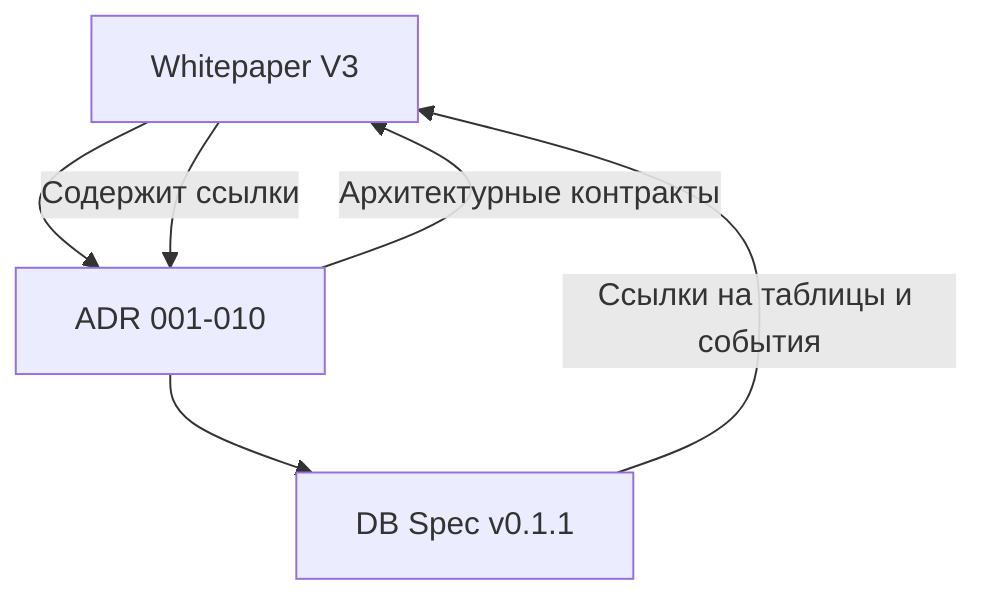

# README — Aboba Project: Источники Правды и Структура Документации

---

## 🧭 Назначение

Этот README описывает систему документации проекта **Aboba** и структуру источников правды (Sources of Truth), на которых строится вся архитектура, бэкенд, AI‑модерация и будущий фронтенд.

Все документы связаны между собой и представляют **единое дерево консистентных спецификаций**. Любые изменения должны фиксироваться во всех затронутых источниках.

---

## 📚 1. Источники Правды (Sources of Truth)

Проект Aboba имеет **три группы источников правды**, каждая из которых выполняет уникальную роль в архитектуре:

### 🧩 1. Aboba Whitepaper 

Фундаментальный документ, описывающий **миссию, цели, модули, архитектуру, события, безопасность, AI‑модерацию и Roadmap**.

- Назначение: стратегический и технический baseline проекта.
- Структура: введение → архитектура → основные процессы → безопасность → observability → roadmap.
- Содержит прямые ссылки на ADR и DB Spec.


### 🗂️ 2. DB Spec (v0.1)

Техническая спецификация базы данных Aboba.

- Назначение: единственное описание структуры всех таблиц, FK, индексов, CHECK‑ограничений и бизнес‑правил.
- Содержит чёткую связь с ADR‑001…010 (через ссылку на источники решений).
- Каждая таблица описана в формате: *назначение → поля → ограничения → индексы → бизнес‑правила*.
- Версия: **v0.1.1 (Approved)**.

### ⚙️ 3. ADR‑001 … ADR‑010 (Architectural Decision Records)

Архитектурные решения, разбитые по ключевым модулям:

| №   | ADR                             | Содержание                                            |
| --- | ------------------------------- | ----------------------------------------------------- |
| 001 | Архитектура процессов и событий | Событийный бэкбон, транзакции, очереди                |
| 002 | Границы и контракты модулей     | Изоляция Bounded Contexts, API контракты              |
| 003 | Auth & Security                 | Passwordless, сессии, без JWT                         |
| 004 | Media Pipeline                  | Presigned uploads, AI‑safe обработка                  |
| 005 | Telegram‑модерация              | Telegram‑бот вместо админки                           |
| 006 | Profiles, Pricing & Services    | Жизненный цикл анкеты и данные                        |
| 007 | Billing & Publication           | Крипто‑биллинг, ончейн‑платежи                        |
| 008 | Observability & Ops             | Метрики, алерты, runbooks                             |
| 009 | AI Moderation & Security        | Безопасность, Telegram‑гварды, аудит                  |
| 010 | AI Moderation Engine            | Аналитика Rekognition/Textract, ai\_score, приоритеты |

ADR файлы формируют **архитектурный скелет системы**, а DB Spec и Whitepaper — её тело и нервы.

---

## 🧱 2. Структура Репозитория `/docs`

```
/docs
  ├── aboba_whitepaper.md         # Aboba Whitepaper (Source of Truth)
  ├── db_spec_v_0_1.md            # Database Spec (Approved)
  ├── adr/
  │    ├── adr_001_архитектурный_стиль_и_процессы_обновлённый.md
  │    ├── adr_002_границы_и_контракты.md
  │    ├── ...
  │    ├── adr_010_ai_moderation_engine.md
  └── README.md                     # (текущий документ)
```

---

## 🧩 3. Взаимосвязь Документов



**Принцип:** каждый уровень уточняет предыдущий, но не противоречит ему.\
Whitepaper = стратегия → ADR = архитектура → DB Spec = реализация данных.

---

## 💻 4. Frontend Spec (не Source of Truth, но согласован)

Файл `frontend_spec_production.md` описывает **продакшн‑уровневый фронтенд** на Next.js 14 + TypeScript.\
Он **построен 1:1 на основе Whitepaper, ADR и DB Spec**, но пока **не считается источником правды** (может изменяться в процессе разработки UI/UX и тестирования).

- Следует ADR‑002 (модульные границы) и ADR‑006 (данные профилей).
- Отражает настоящие контракты API, statemachine статусов, upload‑pipeline.
- Подлежит синхронизации перед релизом MVP‑prod.

---

## ✅ 5. Правила обновления

1. **Изменение бизнес‑логики** → сначала обновляем ADR, затем Whitepaper, потом DB Spec.
2. **Изменение схемы данных** → фиксируем в DB Spec, затем корректируем ADR и Whitepaper.
3. **Фронтенд** обновляется последним, после фиксации новых контрактов.
4. Все изменения проходят ревью (Tech Lead + AI Architect).
5. В README фиксируется новая версия документов и дата синхронизации.

---

---

## 🧠 Итог

Aboba Documentation — это **самосогласованный набор источников правды**, гарантирующий, что архитектура, данные, AI‑модерация и бэкенд развиваются синхронно и без расхождений.

Фронтенд‑спек опирается на эти документы и служит мостом к пользовательскому интерфейсу, но его финальная фиксация произойдёт после стабилизации API и релиза MVP.

